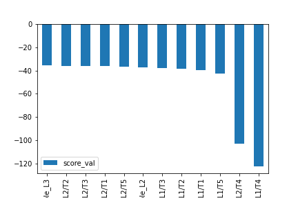
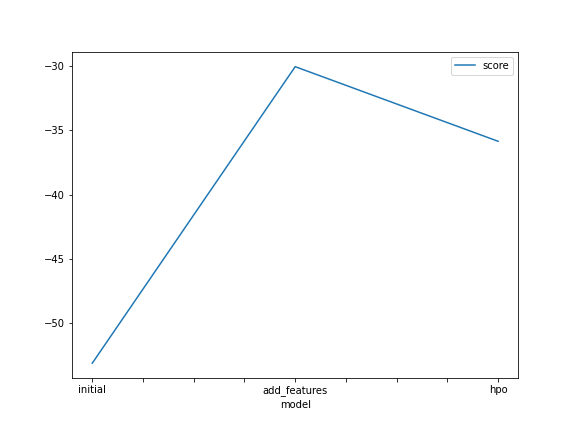
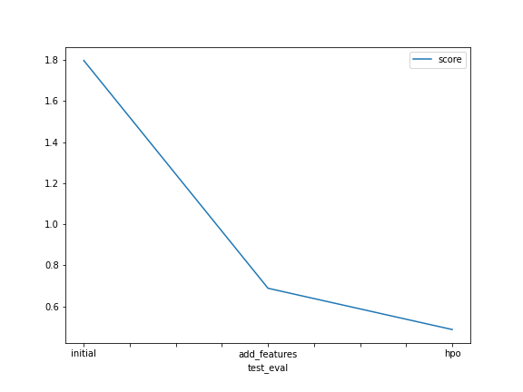

# Report: Predict Bike Sharing Demand with AutoGluon Solution
#### Abdallah Ibrahim

## Initial Training
### What did you realize when you tried to submit your predictions? What changes were needed to the output of the predictor to submit your results?

I needed to make sure that I remove negative values, so that kaggle accepts the submission

### What was the top ranked model that performed?

**WeightedEnsemble_L3**



## Exploratory data analysis and feature creation
### What did the exploratory analysis find and how did you add additional features?

I found that I needed to change some columns data types, and do some feature engineering

- No null values 
- Created a histogram of all features to show the distribution of each one relative to the data.
- Changed the [season, weather, holiday, workingday] columns type to 'category', so that AutoGluon understands that these are categorical not numerical features
- Changed the datetime column type to datetime
- Created new features [year, month, day, hour] from the datetime feature

### How much better did your model preform after adding additional features and why do you think that is?

Around 61.75% better, because the additional features where significant so they helped the model reach a better result

## Hyper parameter tuning
### How much better did your model preform after trying different hyper parameters?

Around 29.25% better

### If you were given more time with this dataset, where do you think you would spend more time?

I would spend more time on feature engineering, because it is the most important part of the workflow, and it resulted in the largest score improvement

### Create a table with the models you ran, the hyperparameters modified, and the kaggle score.

|model|NN|GBM|time_limit|score|
|--|--|--|--|--|
|initial|default|default|600|1.79775|
|add_features|default|default|600|0.68768|
|hpo|nn_options|gbm_options|900|0.48650|

- NN : neural networks training hyperparameters
- GBM :  LightGBM Gradient boosted trees training hyperparameters
- time_limit : the total training time for autogluon
---
nn_options: changed the no. of epochs, the learning rate and the dropout probability
gbm_options: changed the no. of boosting rounds and the no. of leaves in trees


### Create a line plot showing the top model score for the three (or more) training runs during the project.


### Create a line plot showing the top kaggle score for the three (or more) prediction submissions during the project.



## Summary
#### Intro
- Setting up Kaggle
- Downloading the Dataset
- importing AutoGluon
- Looking at the data using `.info()` and `.describe()`
- submitting predictions of a model with default hyperparameters and no feature engineering or addition of new features

#### EDA
- Added new features and changed the datatype of some columns

The model improved by around 61.75%, due to recognizing the categorical features as categorical and the newly introduced features that helped the model extract patterns better.

#### Hyperparameters Tuning

```python
nn_options = {  # specifies non-default hyperparameter values for neural network models
    'num_epochs': 10,  # number of training epochs (controls training time of NN models)
    'learning_rate': ag.space.Real(1e-4, 1e-2, default=5e-4, log=True),  # learning rate used in training (real-valued hyperparameter searched on log-scale)
    'dropout_prob': ag.space.Real(0.0, 0.5, default=0.1),  # dropout probability (real-valued hyperparameter)
}

gbm_options = {  # specifies non-default hyperparameter values for lightGBM gradient boosted trees
    'num_boost_round': 100,  # number of boosting rounds (controls training time of GBM models)
    'num_leaves': ag.space.Int(lower=26, upper=66, default=36),  # number of leaves in trees (integer hyperparameter)
}

hyperparameters = {  # hyperparameters of each model type
                   'GBM': gbm_options,
                   'NN': nn_options,
                  }


num_trials = 5 # no. of different configurations of hyperparameters to try
search_strategy = "auto" # to tune hyperparameters using Bayesian optimization routine with a local scheduler
```

- Changed some hyperparameters of the Neural Networks and lightGBM gradient boosted trees models

**Results**
The model improved by around 29.25%

- The systematic search for the best hyperparameters within the defined search space led to improved model performance compared to using default hyperparameters

- increasing the training time from 600 seconds to 900 seceonds didn't improve the model performance, in fact it made the score slightly worse

